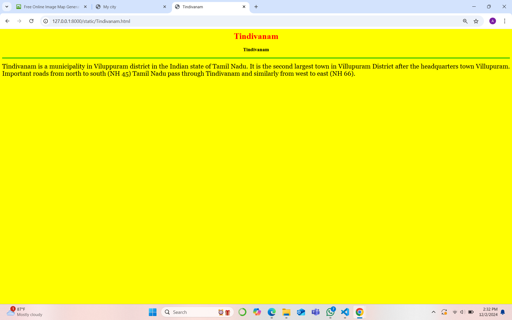
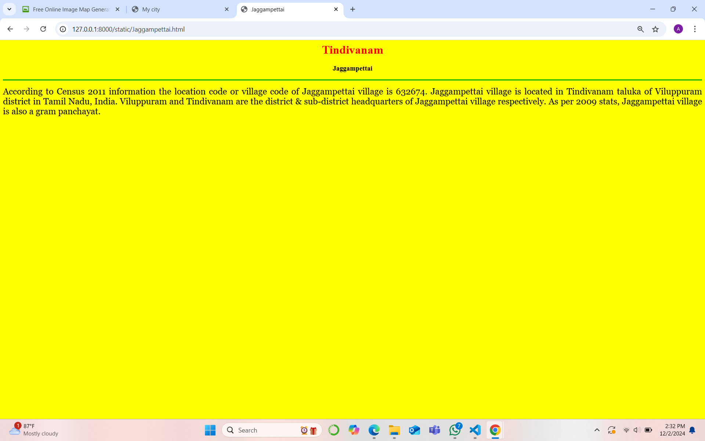
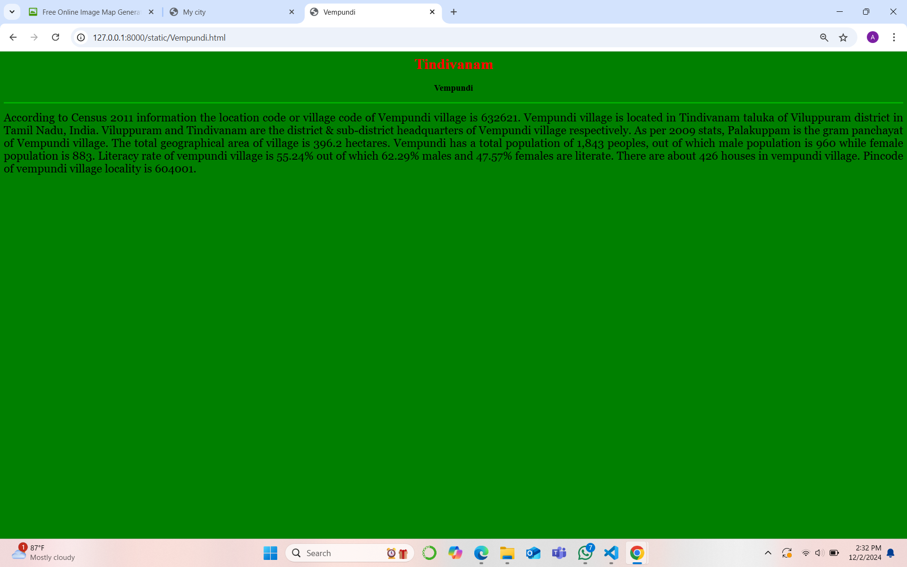
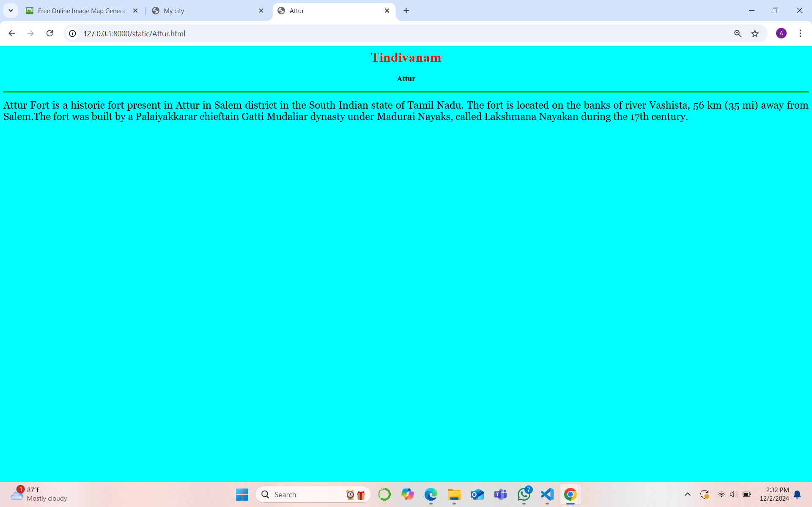
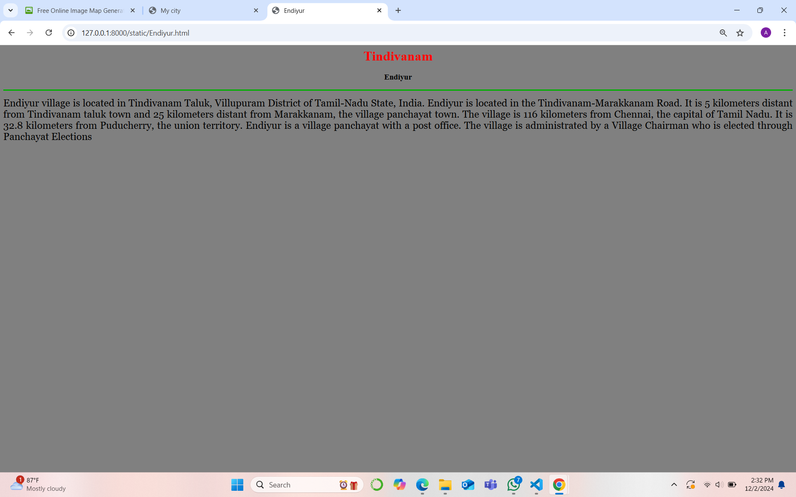

# Ex04 Places Around Me
## Date: 02/12/2024

## AIM
To develop a website to display details about the places around my house.

## DESIGN STEPS

### STEP 1
Create a Django admin interface.

### STEP 2
Download your city map from Google.

### STEP 3
Using ```<map>``` tag name the map.

### STEP 4
Create clickable regions in the image using ```<area>``` tag.

### STEP 5
Write HTML programs for all the regions identified.

### STEP 6
Execute the programs and publish them.

## CODE

```
map.html

<html>
<head>
<title>My city</title>
</head>
<body>
<h1 align="center">
<font color=""red"><b>Tindivanam</b></font>
</h1>
<h3 align=""center">
    <center>
<font color="blue"><b>Avinesh B (24013574)</b></font>
    </center>
</h3>
<center>
    

    <map name="image-map">
        <area target="" alt="Tindivanam" title="Tindivanam" href="Tindivanam.html" coords="884,383,92" shape="circle">
        <area target="" alt="Attur" title="Attur" href="Attur.html" coords="1020,406,1102,447" shape="rect">
        <area target="" alt="Vempundi" title="Vempundi" href="Vempundi.html" coords="608,359,710,407" shape="rect">
        <area target="" alt="Jaggampettai" title="Jaggampettai" href="Jaggampettai.html" coords="891,519,757,487" shape="rect">
        <area target="" alt="Endiyur" title="Endiyur" href="Endiyur.html" coords="1069,479,1151,519" shape="rect">
    </map>    
</center>
</body>
</html>

Tindivanam.html

<html>
    <head>
        <title>
            Tindivanam
        </title>
    </head>
    <body bgcolor="yellow">
        <h1 align="center">
            <font color="red"><b>Tindivanam</b></font>

        </h1>
        <h3 align="center">
            <font color="black"><b>Tindivanam</b></font>
        </h3>
        
       <hr size="3" color="light brown">
       <p align="justify">
        <font face="Georgia" size="5">
            Tindivanam is a municipality in Viluppuram district in the Indian state of Tamil Nadu. It is the second largest town in Villupuram District after the headquarters town Villupuram. Important roads from north to south (NH 45) Tamil Nadu pass through Tindivanam and similarly from west to east (NH 66).
            
        </font>
       </p>
    </body>
</html>

Jaggampettai.html

<html>
    <head>
        <title>
             Jaggampettai 
        </title>
    </head>
    <body bgcolor="pink">
        <h1 align="center">
            <font color="red"><b>Tindivanam</b></font>

        </h1>
        <h3 align="center">
            <font color="black"><b>Jaggampettai</b></font>
        </h3>
        
       <hr size="3" color="light brown">
       <p align="justify">
        <font face="Georgia" size="5">
            According to Census 2011 information the location code or village code of Jaggampettai village is 632674. Jaggampettai village is located in Tindivanam taluka of Viluppuram district in Tamil Nadu, India. Viluppuram and Tindivanam are the district & sub-district headquarters of Jaggampettai village respectively. As per 2009 stats, Jaggampettai village is also a gram panchayat.


            
        </font>
       </p>
    </body>
</html>

Attur.html

<html>
    <head>
        <title>
             Attur 
        </title>
    </head>
    <body bgcolor="cyan">
        <h1 align="center">
            <font color="red"><b>Tindivanam</b></font>

        </h1>
        <h3 align="center">
            <font color="black"><b>Attur</b></font>
        </h3>
        
       <hr size="3" color="light brown">
       <p align="justify">
        <font face="Georgia" size="5">
            
            Attur Fort is a historic fort present in Attur in Salem district in the South Indian state of Tamil Nadu. The fort is located on the banks of river Vashista, 56 km (35 mi) away from Salem.The fort was built by a Palaiyakkarar chieftain Gatti Mudaliar dynasty under Madurai Nayaks, called Lakshmana Nayakan during the 17th century.

            
        </font>
       </p>
    </body>
</html>

Vempundi.html

<html>
    <head>
        <title>
             Vempundi 
        </title>
    </head>
    <body bgcolor="green">
        <h1 align="center">
            <font color="red"><b>Tindivanam</b></font>

        </h1>
        <h3 align="center">
            <font color="black"><b>Vempundi</b></font>
        </h3>
        
       <hr size="3" color="light brown">
       <p align="justify">
        <font face="Georgia" size="5">
            
            According to Census 2011 information the location code or village code of Vempundi village is 632621. Vempundi village is located in Tindivanam taluka of Viluppuram district in Tamil Nadu, India. Viluppuram and Tindivanam are the district & sub-district headquarters of Vempundi village respectively. As per 2009 stats, Palakuppam is the gram panchayat of Vempundi village.

            The total geographical area of village is 396.2 hectares. Vempundi has a total population of 1,843 peoples, out of which male population is 960 while female population is 883. Literacy rate of vempundi village is 55.24% out of which 62.29% males and 47.57% females are literate. There are about 426 houses in vempundi village. Pincode of vempundi village locality is 604001.

            
        </font>
       </p>
    </body>
</html>

Endiyur.html

<html>
    <head>
        <title>
             Endiyur
        </title>
    </head>
    <body bgcolor="grey">
        <h1 align="center">
            <font color="red"><b>Tindivanam</b></font>

        </h1>
        <h3 align="center">
            <font color="black"><b>Endiyur</b></font>
        </h3>
        
       <hr size="3" color="light brown">
       <p align="justify">
        <font face="Georgia" size="5">
            
            Endiyur village is located in Tindivanam Taluk, Villupuram District of Tamil-Nadu State, India.

Endiyur is located in the Tindivanam-Marakkanam Road. It is 5 kilometers distant from Tindivanam taluk town and 25 kilometers distant from Marakkanam, the village panchayat town. The village is 116 kilometers from Chennai, the capital of Tamil Nadu. It is 32.8 kilometers from Puducherry, the union territory. Endiyur is a village panchayat with a post office. The village is administrated by a Village Chairman who is elected through Panchayat Elections

            
        </font>
       </p>
    </body>
</html>

```


## OUTPUT














## RESULT
The program for implementing image maps using HTML is executed successfully.
